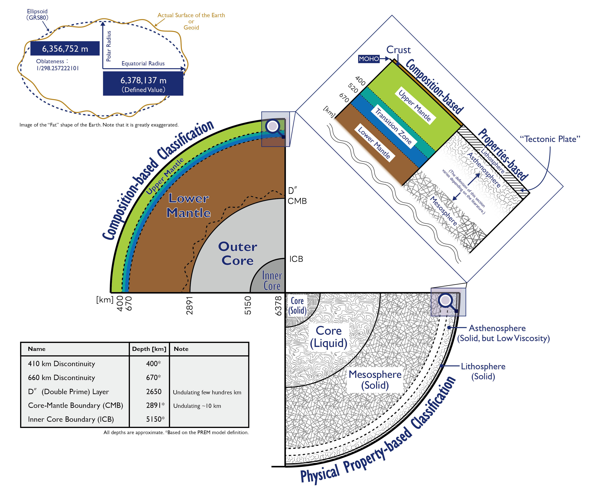
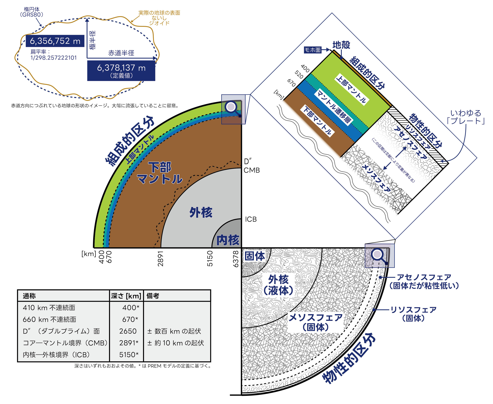
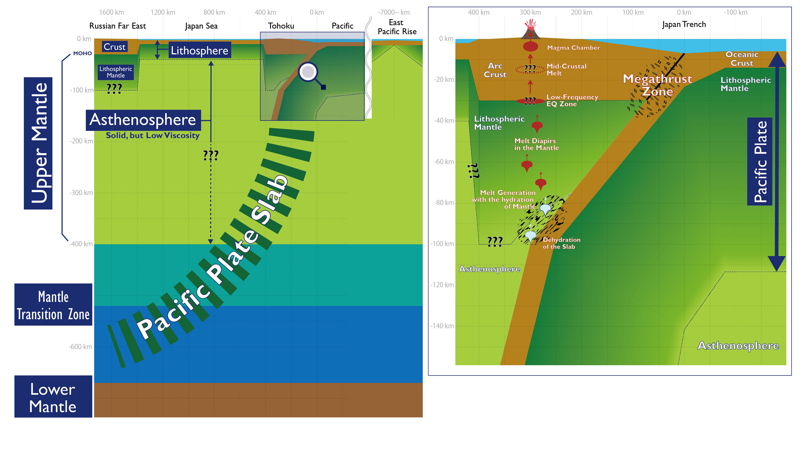

# The Compilation of Figures for Geosciences
My original scientific figures for Geosciences.
> Ikegami (2026) The Compilation of Figures for Geosciences. Github. https://github.com/geoign/Geoscience_Figures/ Retrieved on YYYY-MM-DD.

---

### License
This project is licensed under the Creative Commons Attribution-NonCommercial 4.0 International License (CC BY-NC 4.0). 

**No Commercial Use.** No profit from this figure.  
You can use this figure freely for personal and educational purposes. 
For commercial use, contact me. 

---

### Encouraging to Illustrators / Artists
I also encourage people "re-drawing" or "getting inspired" from these figures. 
My license restriction does not apply to such figures or illustrations.

---

### Disclaimer
I did my best to draw these figures. 
But still, there might be mistakes. Please double check if you plan to do something important. 

---

# Deep Earth (Japanese & English)
A figure showing the deep internal layers of the Earth. 
Link to . 

  
  
  
  

## Updates
2026/02/01 The "Deep Earth" figure has been added.
